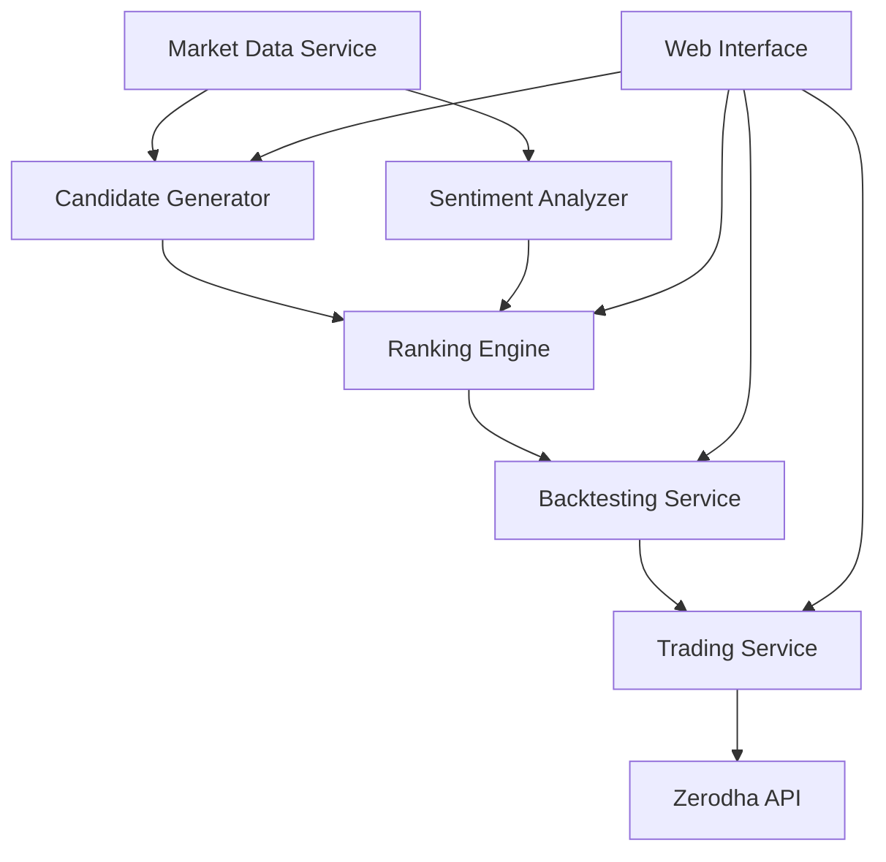

# AlgoDiscovery - System Architecture

## 1. System Components

```
alg-discovery/
├── services/
│   ├── market_data/                 # Market Data Service
│   │   ├── price_data/             # Price and fundamental data
│   │   ├── sentiment_data/         # Perplexity integration
│   │   └── data_pipeline/          # Data processing pipeline
│   │
│   ├── candidate_generator/        # Candidate Generation Service
│   │   ├── technical_scanner/      # Technical analysis
│   │   ├── fundamental_scanner/    # Fundamental analysis
│   │   └── sentiment_scanner/      # Sentiment analysis
│   │
│   ├── ranking_engine/            # Ranking Service
│   │   ├── feature_engineering/    # Feature processing
│   │   ├── ranking_models/        # ML models
│   │   └── scoring_system/        # Scoring algorithms
│   │
│   ├── backtesting/               # Backtesting Service
│   │   ├── strategy_engine/       # Strategy framework
│   │   ├── performance/           # Performance metrics
│   │   └── optimization/          # Strategy optimization
│   │
│   ├── trading/                   # Trading Service
│   │   ├── order_manager/         # Order management
│   │   ├── risk_manager/          # Risk management
│   │   └── position_manager/      # Position tracking
│   │
│   └── sentiment_analyzer/        # Sentiment Analysis Service
│       ├── perplexity_client/     # Perplexity API integration
│       ├── news_analyzer/         # News analysis
│       ├── social_analyzer/       # Social media analysis
│       └── sentiment_scoring/     # Sentiment scoring
│
├── web_app/                       # Streamlit Frontend
│   ├── pages/                    # Streamlit pages
│   ├── components/               # UI components
│   └── utils/                    # Frontend utilities
│
├── shared/                       # Shared Components
│   ├── models/                   # Data models
│   ├── utils/                    # Common utilities
│   └── config/                   # Configuration
│
└── infrastructure/               # Infrastructure
    ├── docker/                   # Docker configurations
    ├── kubernetes/               # K8s manifests
    └── monitoring/               # Monitoring setup
```

## 2. Data Flow Architecture



## 3. Database Design

### 3.1 Core Tables
```sql
-- Market Data
CREATE TABLE price_data (
    symbol VARCHAR(10),
    timestamp TIMESTAMP,
    open DECIMAL(10,2),
    high DECIMAL(10,2),
    low DECIMAL(10,2),
    close DECIMAL(10,2),
    volume BIGINT,
    PRIMARY KEY (symbol, timestamp)
);

-- Fundamental Data
CREATE TABLE fundamental_data (
    symbol VARCHAR(10),
    date DATE,
    pe_ratio DECIMAL(10,2),
    pb_ratio DECIMAL(10,2),
    roe DECIMAL(10,2),
    debt_to_equity DECIMAL(10,2),
    PRIMARY KEY (symbol, date)
);

-- Sentiment Data
CREATE TABLE sentiment_data (
    symbol VARCHAR(10),
    timestamp TIMESTAMP,
    sentiment_score DECIMAL(5,2),
    news_sentiment DECIMAL(5,2),
    social_sentiment DECIMAL(5,2),
    perplexity_score DECIMAL(5,2),
    PRIMARY KEY (symbol, timestamp)
);

-- Trading Signals
CREATE TABLE trading_signals (
    signal_id UUID,
    symbol VARCHAR(10),
    timestamp TIMESTAMP,
    signal_type VARCHAR(20),
    confidence_score DECIMAL(5,2),
    technical_score DECIMAL(5,2),
    fundamental_score DECIMAL(5,2),
    sentiment_score DECIMAL(5,2),
    PRIMARY KEY (signal_id)
);

-- Trades
CREATE TABLE trades (
    trade_id UUID,
    symbol VARCHAR(10),
    entry_time TIMESTAMP,
    exit_time TIMESTAMP,
    entry_price DECIMAL(10,2),
    exit_price DECIMAL(10,2),
    quantity INTEGER,
    pnl DECIMAL(10,2),
    strategy_id UUID,
    PRIMARY KEY (trade_id)
);
```

## 4. API Design

### 4.1 Market Data API
```python
# Market Data Endpoints
GET /api/v1/market/price/{symbol}
GET /api/v1/market/fundamental/{symbol}
GET /api/v1/market/sentiment/{symbol}
GET /api/v1/market/stream/{symbol}  # WebSocket

# Candidate Generation Endpoints
POST /api/v1/candidates/generate
GET /api/v1/candidates/list
GET /api/v1/candidates/{symbol}/details

# Ranking Endpoints
POST /api/v1/ranking/score
GET /api/v1/ranking/top
GET /api/v1/ranking/history

# Backtesting Endpoints
POST /api/v1/backtest/run
GET /api/v1/backtest/results/{id}
GET /api/v1/backtest/optimize

# Trading Endpoints
POST /api/v1/trading/order
GET /api/v1/trading/positions
GET /api/v1/trading/portfolio

# Sentiment Analysis Endpoints
GET /api/v1/sentiment/analyze/{symbol}
GET /api/v1/sentiment/stream  # WebSocket
POST /api/v1/sentiment/batch
``` 